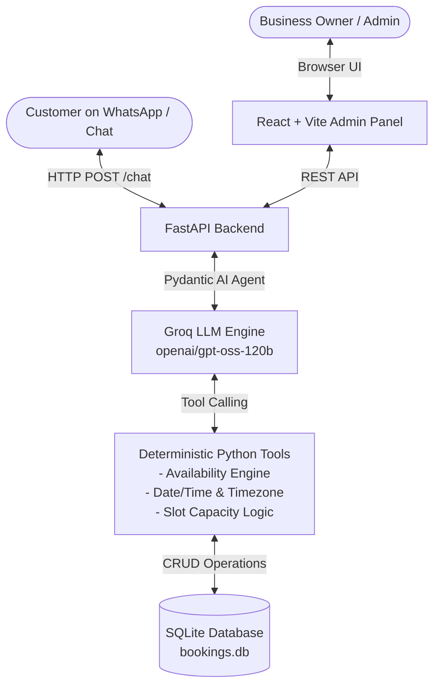

# 🤖 WhatsApp AI Booking Agent & Admin Dashboard

An intelligent, multi-turn AI booking agent for small businesses (salons, clinics, consulting, repair shops). Customers book appointments conversationally via chat, while business owners manage slot capacity, working hours, and real-time bookings from a dedicated React admin dashboard.

---

## 🎯 Purpose

Booking appointments through forms or phone calls can be rigid and tedious. This project automates the entire scheduling lifecycle:
1. **Conversational Booking:** Customers chat naturally (e.g., *"book me 2pm tomorrow"*), and the AI checks real-time slot availability, collects customer information step-by-step, asks for explicit confirmation, and confirms the booking with a unique Booking ID.
2. **Business Control:** Business owners can configure opening/closing hours, slot durations, and concurrent customer capacity per slot directly from a web dashboard.

---

## 🏗️ Architecture Overview



---

## ⚡ Tech Stack

| Component | Technology | Why We Used It |
|---|---|---|
| **Agent Framework** | [Pydantic AI](https://ai.pydantic.dev/) | Type-safe tool calling, schema validation, `RunContext` dependency injection, and native message history support. |
| **LLM Provider** | [Groq](https://groq.com/) | Ultra-low latency inference (<1.5s per turn) enabling responsive chat experiences. |
| **LLM Model** | `openai/gpt-oss-120b` / `qwen/qwen3.8-27b` | High reasoning capability and reliable function calling without hallucinating tool parameters. |
| **Backend API** | [FastAPI](https://fastapi.tiangolo.com/) | Modern, asynchronous Python web framework with auto-generated OpenAPI documentation and CORS support. |
| **Database** | SQLite3 | Zero-configuration, file-based relational database with WAL (Write-Ahead Logging) mode. |
| **Timezone Engine** | Python `zoneinfo` | Accurate date/time calculations in `Asia/Kolkata` (IST) to prevent training-cutoff and timezone drift bugs. |
| **Frontend UI** | React 18 + Vite | Lightweight, fast SPA with React Router DOM and responsive vanilla CSS (no heavy UI frameworks). |

---

## 🧠 Key Engineering Highlights

### 1. Pydantic AI Agent & Tool Execution
The agent uses Pydantic AI to bind tools directly with strict types and runtime dependencies. The LLM is never allowed to calculate dates or execute bookings without structured tool validation:

```python
from pydantic_ai import Agent, RunContext
from pydantic_ai.models.groq import GroqModel
from pydantic_ai.providers.groq import GroqProvider

model = GroqModel(config.LLM_MODEL, provider=GroqProvider(api_key=config.GROQ_API_KEY))
booking_agent = Agent(model=model)

@booking_agent.tool
def get_available_slots(ctx: RunContext[None], query_date: str):
    """Check all available slots for a specific date (YYYY-MM-DD)."""
    return tools.check_available_slots(query_date)

@booking_agent.tool
def book_appointment(
    ctx: RunContext[None],
    user_name: str,
    user_phone: str,
    booking_date: str,
    start_time: str,
    service_type: str = "",
    notes: Optional[str] = None,
) -> Dict[str, Any]:
    """Books the appointment in SQLite after customer confirms."""
    return tools.book_appointment_tool(
        user_name=user_name,
        user_phone=user_phone,
        booking_date=booking_date,
        start_time=start_time,
        service_type=service_type,
        notes=notes,
    )
```

### 2. Multi-Turn Conversation Memory
Conversation history is maintained per customer phone number in the `chat_history` table. On each turn, previous messages are reconstructed into Pydantic AI's `ModelMessage` objects and passed into `agent.run(..., message_history=history)`.

### 3. Timezone & Deterministic Date Math
LLMs frequently hallucinate relative dates (*"tomorrow"*, *"next Friday"*) due to model cutoff dates or UTC offsets. 
- Python's `zoneinfo.ZoneInfo("Asia/Kolkata")` computes `now()`.
- A dedicated `resolve_date(text)` helper parses relative words and weekday names into real `YYYY-MM-DD` strings before querying database slots.

### 4. Dynamic Slot Capacity Engine
Instead of blocking a slot after 1 booking, the availability engine supports configurable capacity:
$$\text{Available} = (\text{Active Bookings in Slot}) < \text{Capacity}$$
*Example:* A salon open `09:00–12:00` with 30-min intervals and capacity `5` creates 6 time slots, each allowing up to 5 concurrent customers before marking the slot as `FULL`.

---

## 📁 Repository Structure

```
├── code/
│   ├── backend/
│   │   ├── app/
│   │   │   ├── __init__.py
│   │   │   ├── config.py         # Environment configuration
│   │   │   ├── models.py         # Pydantic data schemas
│   │   │   ├── db.py             # SQLite database layer & migrations
│   │   │   ├── tools.py          # Availability & date resolution engine
│   │   │   ├── agent.py          # Pydantic AI agent & system prompts
│   │   │   └── main.py           # FastAPI routes & CORS setup
│   │   ├── .env.example
│   │   ├── requirements.txt      # Python dependencies
│   │   └── README.md
│   │
│   └── frontend/
│       ├── src/
│       │   ├── pages/
│       │   │   ├── Bookings.jsx  # Date picker, bookings list & slot grid
│       │   │   └── Settings.jsx  # Business hours & capacity settings form
│       │   ├── App.jsx           # Navbar & routing
│       │   ├── index.css         # Clean, responsive styles
│       │   └── main.jsx
│       ├── package.json
│       └── vite.config.js
└── docs/
    └── README.md
```

---

## 🚀 Getting Started

### Prerequisites
- Python 3.9+
- Node.js 18+
- Groq API Key ([Get one free at console.groq.com](https://console.groq.com))

---

### 1. Backend Setup

```bash
# Navigate to backend directory
cd code/backend

# Create virtual environment
python3 -m venv venv
source venv/bin/activate  # On Windows: venv\Scripts\activate

# Install dependencies
pip install -r requirements.txt

# Create your .env file
cp .env.example .env
```

Edit `code/backend/.env`:
```env
APP_NAME=BookingAgentAPI
DEBUG=True
HOST=0.0.0.0
PORT=8000

# LLM Provider
LLM_MODEL=openai/gpt-oss-120b
GROQ_API_KEY=gsk_your_actual_groq_api_key_here

# Database & Timezone
DB_PATH=bookings.db
TIMEZONE=Asia/Kolkata
```

Run the backend server:
```bash
uvicorn app.main:app --host 0.0.0.0 --port 8000 --reload
```
Backend API will be live at `http://localhost:8000` (Interactive docs: `http://localhost:8000/docs`).

---

### 2. Frontend Setup

```bash
# Navigate to frontend directory
cd code/frontend

# Install packages
npm install

# Start Vite dev server
npm run dev
```
Open `http://localhost:5173` (or `http://localhost:5174`) in your browser to access the Admin Panel.

---

## 📡 REST API Reference

| Method | Endpoint | Description |
|---|---|---|
| `POST` | `/chat` | Chat endpoint for the booking agent with multi-turn history |
| `GET` | `/api/settings` | Retrieve business hours, slot duration, and capacity |
| `PUT` | `/api/settings` | Update business hours, slot duration, and capacity |
| `GET` | `/api/slots?date=YYYY-MM-DD` | Get slots with `booked_count` / `capacity` and availability |
| `GET` | `/api/bookings` | List all bookings (supports `?phone=...` query) |
| `POST` | `/api/bookings` | Manually create a booking |
| `POST` | `/api/bookings/reschedule` | Reschedule an existing booking |
| `POST` | `/api/bookings/cancel` | Cancel an appointment |
| `GET` | `/health` | Health check endpoint |

---

## 🧪 Testing the 3-Step Booking Conversation

You can test the agent directly via `curl` or any API client:

```bash
# Turn 1: Initial request
curl -X POST "http://localhost:8000/chat" \
  -H "Content-Type: application/json" \
  -d '{"message": "book me 2pm tomorrow", "user_phone": "+919876543210"}'
# Output: "I can help with that! Could you please provide your full name?"

# Turn 2: Provide name
curl -X POST "http://localhost:8000/chat" \
  -H "Content-Type: application/json" \
  -d '{"message": "Akshay", "user_phone": "+919876543210"}'
# Output: "I have an appointment for Akshay on 2026-08-29 at 14:00. Would you like me to confirm this booking?"

# Turn 3: Confirmation
curl -X POST "http://localhost:8000/chat" \
  -H "Content-Type: application/json" \
  -d '{"message": "yes", "user_phone": "+919876543210"}'
# Output: "Your appointment has been confirmed! Booking ID: BK-XXXXXX"
```

---

## 🛣️ Roadmap / Upcoming Work
- [ ] Direct WhatsApp Cloud API (Meta Webhooks) integration for receiving/sending real WhatsApp messages.
- [ ] Admin panel authentication & multi-tenant business support.
- [ ] SMS / Email automated appointment reminders.
